<h1> Своя почта </h1>

- Bat:  почтовый клиент
- Postfix: smtp сервер
- Dovecot: IMAP сервер

<h2> Postfix (smtp server)</h2>

применим первичные настройки: <br>
```shell
dpkg-reconfigure postfix
```
- тип почты
- название почты
- поддерживаемы сети
- проверим, что прослушиваются нужные порты
<br>


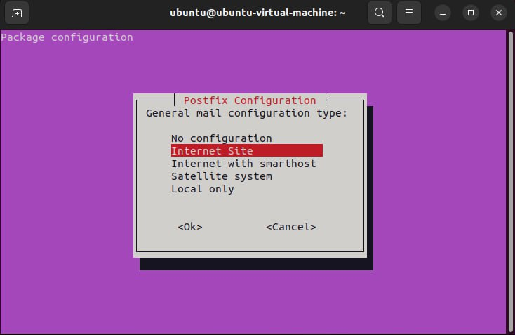

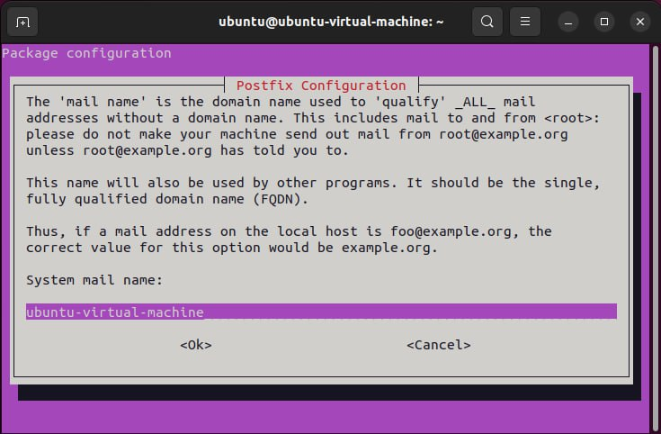

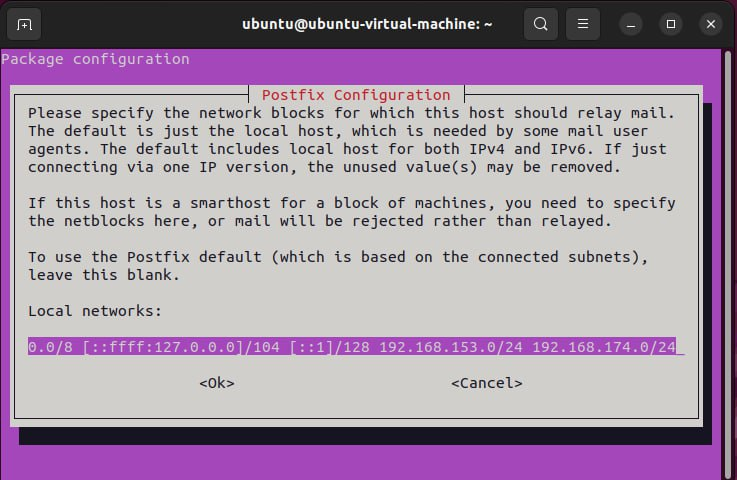


<br>
укажем куда почта будет складываться
для каждого почтового пользователя заведем пользователя в системе (нужно, так как туда складывается их почта)

```shell
sudo postconf -e 'home_mailbox= mail/'
sudo adduser user1
sudo adduser user2
sudo postconf -e 'virtual_alias_maps= hash:etc/postfix/virtual'
```
пропишем таблица соответствия адресов и пользователей
<br> и применим таблицу соответствия
```shell
sudo nano /etc/postfix/virtual
sudo postmap /etc/postfix/virtual
sudo systemctl restart postfix
```

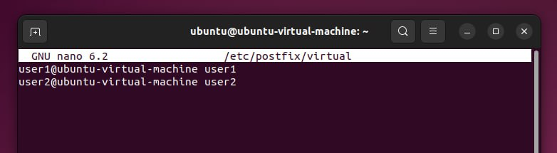

проверим дополнительно, что открылся нужный порт
```shell
netstat -tlpn
```

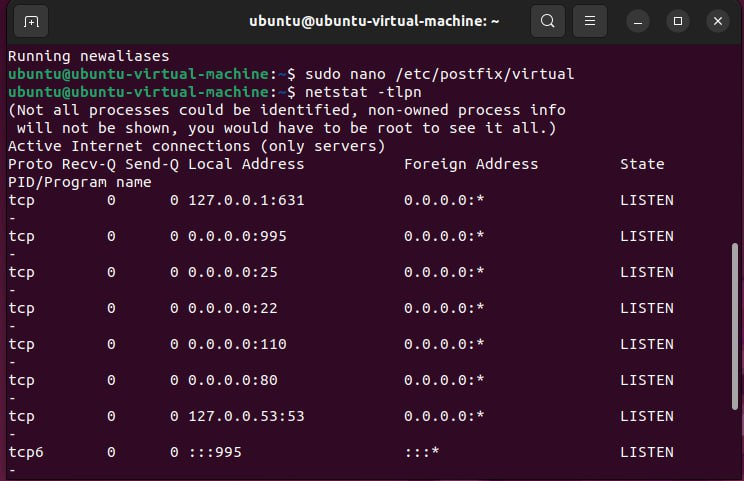

<h2> Dovecot (imap server)</h2>

раскомментировать listen: - чтобы слушал нужные ip
```shell
sudo apt install dovecot-core dovecot-pop3d
sudo nano /etc/dovecot/dovecot.conf
```
сделаем следующее, чтобы траффик был нагляднее:
disable_plain_text =no (10)
auth = plain login (100)
```shell
sudo nano -l /etc/dovecot/conf.d/10-auth.conf
```
maildir (30) - пропишем, куда будет складываться почта
```shell
sudo nano -l /etc/dovecot/conf.d/10-mail.conf
```
то откуда прослушивать получаемые сообщения
<br> связка postfix-dovecot
<br> unix_listener = /var/spool/postfix/virtual/auth (100)
```shell
sudo nano -l /etc/dovecot/conf.d/10-master.conf
sudo systemctl restart dovecot
```

<h2> The Bat (mail client)</h2>

- заведем пользователей с указанием smtp и imap сервера

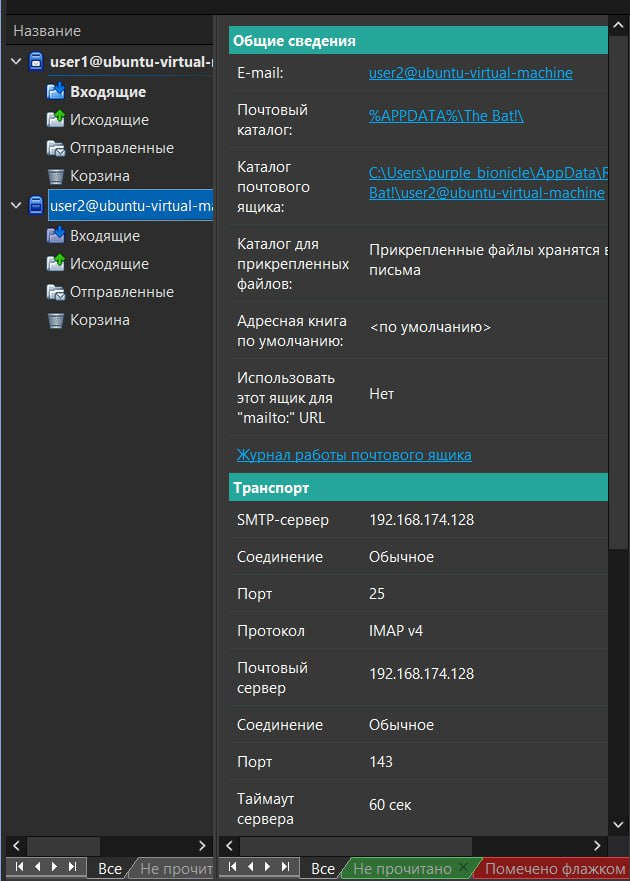

- начнем записывать траффик wireshark 
- отправим письмо
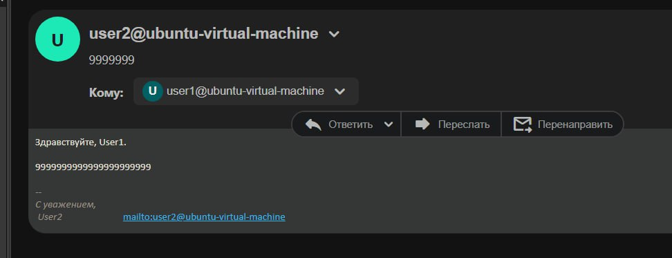
- не будем нажимать кнопку принять почту на другом пользователе (как видно письма нет)
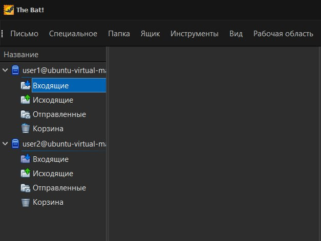
- залезем на imap сервере в /home/user1/mail/new (сюда складывается входящая почта для пользователя)
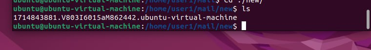
- заметим, что есть письмо, которое еще не было доставлено юзеру
- залезем в него и увидим наши "9"
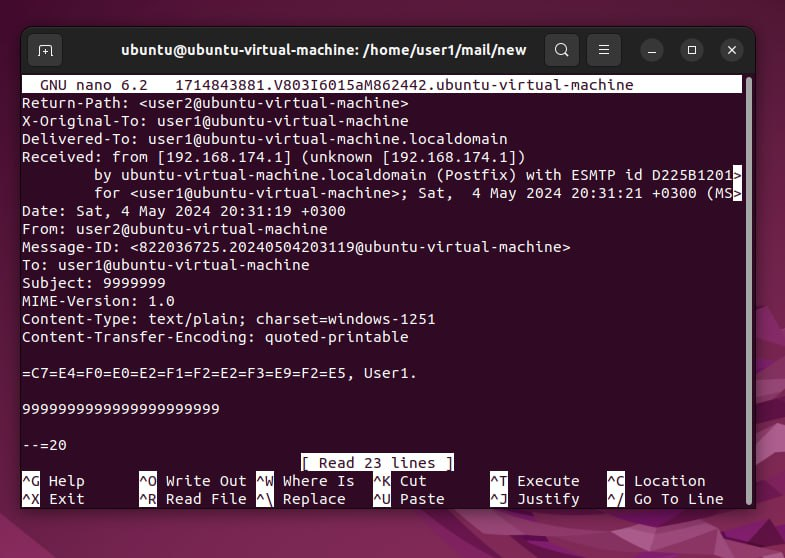
- загрузим на клиенте почту
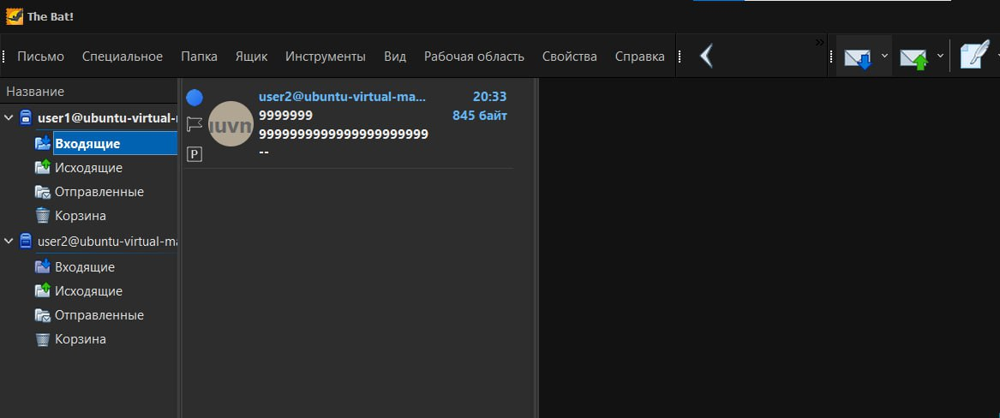

<h2> Wireshark</h2>

- применим фильтр для траффика 

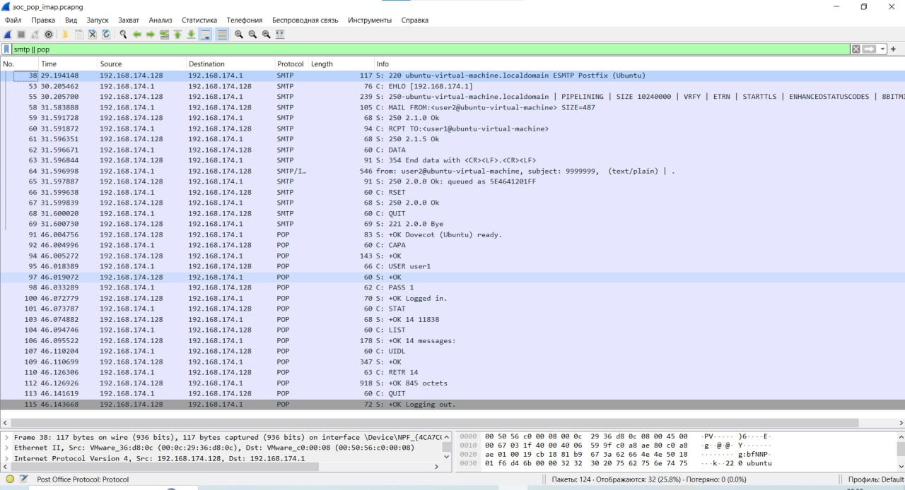

- найдем наше сообщение в траффике исходящей почты (smtp)
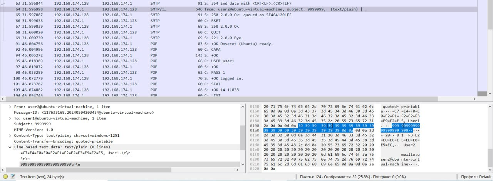
- найдем наше сообщение в траффике входящей почты (imap)
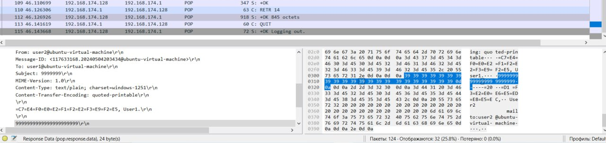